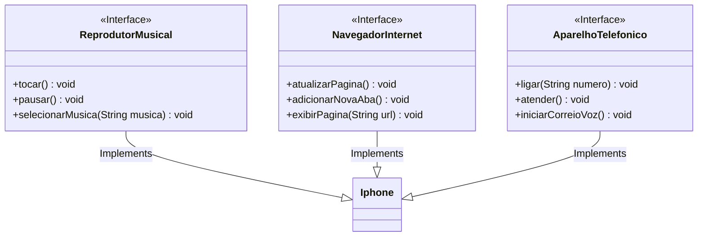

# Claro - java com Spring Boot 
## Projeto Modelagem e Diagramação de um Componente iPhone - UML com Mermaid

#### Funcionalidades a Modelar para o iPhone
1. **Reprodutor Musical**
   - Métodos: `tocar()`, `pausar()`, `selecionarMusica(String musica)`
2. **Aparelho Telefônico**
   - Métodos: `ligar(String numero)`, `atender()`, `iniciarCorreioVoz()`
3. **Navegador na Internet**
   - Métodos: `exibirPagina(String url)`, `adicionarNovaAba()`, `atualizarPagina()`

### UML Desenvolvido (Mermaid)

